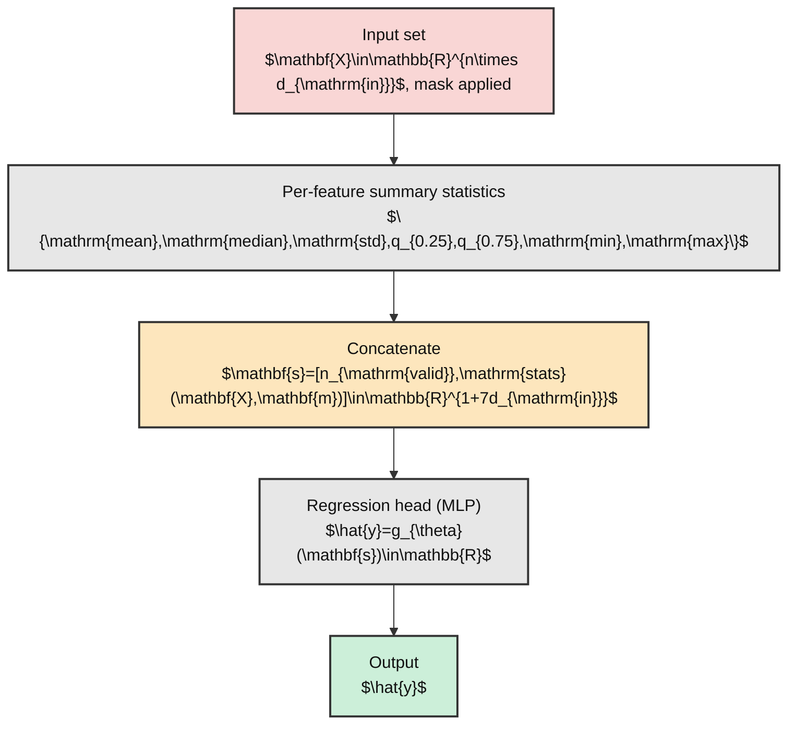
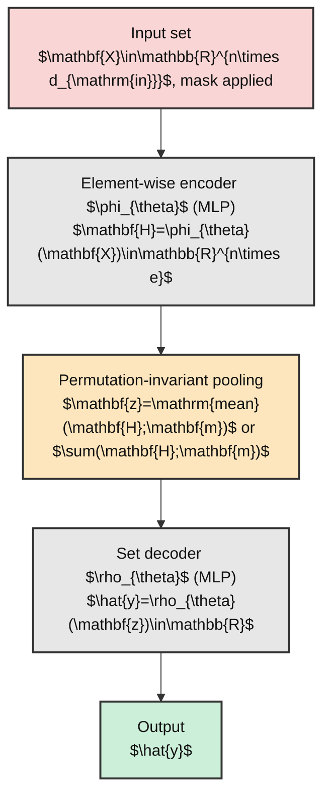
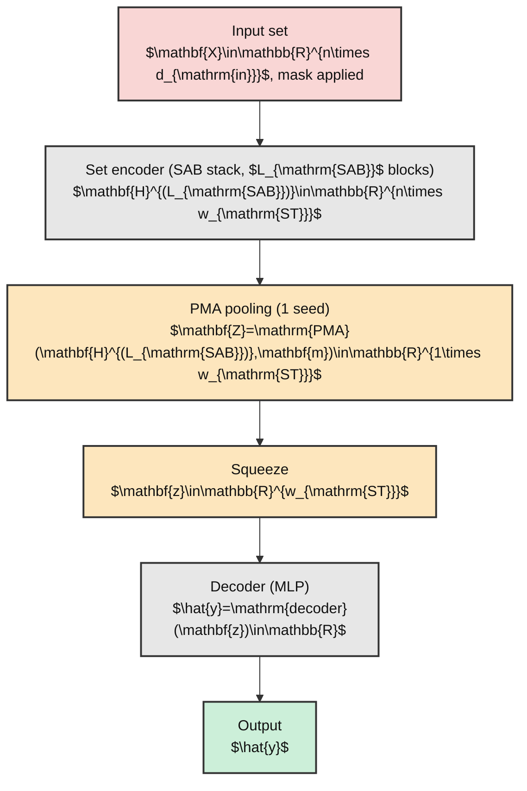

# Machine Learning Framework for Star Cluster Properties Prediction

This repository contains a PyTorch Lightning framework that predicts star cluster properties from variable-size sets of member stars. It implements three permutation-invariant architectures for set-based regression.

## Requirements

Use Python 3.12+ with the packages below. Pinned versions are listed in [`requirements.txt`](./requirements.txt).

- `click`
- `joblib`
- `matplotlib`
- `numpy`
- `pandas`
- `python-dotenv`
- `pytorch_lightning`
- `scikit-learn`
- `torch`
- `torchmetrics`
- `tqdm`
- `pyarrow`

For GPU monitoring during training, activate your environment first, then install either [nvitop](https://github.com/XuehaiPan/nvitop) or [gpustat](https://github.com/wookayin/gpustat).

```bash
# using conda (conda-forge) - pick one
conda install conda-forge::nvitop
conda install conda-forge::gpustat

# or using pip - pick one
pip install nvitop
pip install gpustat
```

To monitor GPU status, run one of the following commands.

```bash
# nvitop
nvitop
```

```bash
# gpustat (macOS/Linux)
watch -n 1 -c gpustat --color
```

## Usage

### Configure Environment

Create a `.env` file from [`.env.template`](.env.template), then set at least these variables.

- `OUTPUT_BASE`: destination for pipeline, dataset, and training outputs
- `JOBLIB_ROOT`: joblib cache root used by the NBODY6 data pipeline

```bash
# Edit .env and set the variables listed above
cp .env.template .env
```

### Prepare Dataset

Build the cached, scaled dataset from NBODY6 pipeline joblib caches. Run this from the `machine-learning` directory.

```bash
python ./src/build_dataset.py \
  --split-mft-json /path/to/split/manifest.json \
  --dataset-export-path dataset  # optional (default: OUTPUT_BASE/dataset)
```

Outputs under the dataset export path include:

- `raw-<split>-shard.npz` — merged per-split raw shards for train, validation, and test
- `scaled-<split>-shard.npz` — scaled shards used for training and evaluation
- `feature_scaler_bundle.joblib`, `target_scaler_bundle.joblib` — fitted scalers
- `dataset_config.json` — manifest, feature/target keys, scaler config, and checksums

#### Notes

- The script requires a split manifest through `--split-mft-json`. See [dataset_split.ipynb](https://github.com/fengshun124/NBODY6-data-pipeline/blob/main/notebooks/dataset_split.ipynb) for generation steps. Joblib caches are loaded from the path in `JOBLIB_ROOT` from `.env`. For background, see the [NBODY6-data-pipeline README](https://github.com/fengshun124/NBODY6-data-pipeline/blob/main/README.md).
- The default feature/target keys and scaler config are defined in the `main` function of `src/build_dataset.py`. Update them there for different fields.

### Train a Model

After building the dataset, invoke the training entrypoint from `machine-learning`.

```bash
# Example: use one GPU
CUDA_VISIBLE_DEVICES=0 python ./src/train.py \
  --dataset /path/to/dataset/ \
  --feature-keys x \
  --feature-keys y \
  --feature-keys z \
  --feature-keys vx \
  --feature-keys vy \
  --feature-keys vz \
  --target-key total_mass_within_2x_r_tidal \
  --model set_transformer \
  --hparam 'hidden_dim=8' \
  --hparam 'num_heads=8' \
  --hparam 'num_sabs=4' \
  --hparam 'output_hidden_dims=(4,2)' \
  --hparam 'dropout=0.2' \
  --num-workers 16 \
  -bs 20480 \
  -lr 1e-4 \
  -wd 3e-3
```

Run with `--help` to see all available options.

```bash
python ./src/train.py --help
```

#### Dataset and Feature/Target Specification

- `--dataset`: path to the dataset export folder created by `build_dataset.py`, with `scaled-*-shard.npz` and `dataset_config.json`
- `--feature-keys`: repeatable per-element input features, such as `x`, `y`, `z`, `vx`, `vy`, `vz`
- `--target-key`: regression target to predict. Must be one of the dataset target keys, such as `time` or `total_mass_within_2x_r_tidal`
- `--num-star-per-sample`: number of stars per input set sample
- `--num-sample-per-snapshot`: number of set samples drawn from each snapshot during training, validation, and testing
- `--drop-probability`: probability of dropping stars when a snapshot has more than `--num-star-per-sample` stars. Default is `0.6`
- `--drop-ratio-range`: lower and upper bound for the dropped-star fraction during random star dropping. Default is `(0.1, 0.9)`

#### Model Selection and Hyperparameters

- `--model`: model architecture name. One of `set_transformer`, `deep_sets`, or `summary_stats`
- `--hparam KEY=VALUE`: repeatable model hyperparameter. Values accept Python literals such as numbers, tuples, and booleans
- `--huber-delta`: delta parameter for Huber loss. Default is `1.0`

Default parameters for each model family are as follows. Update them with `--hparam` as needed.

- **set_transformer**: `hidden_dim=6`, `num_heads=2`, `num_sabs=1`, `output_hidden_dims=None`, `dropout=0.1`, `is_apply_layer_norm=True`.
- **deep_sets**: `phi_hidden_dims=(8, 4)`, `rho_hidden_dims=(8, 4)`, `dropout=0.1`, `pooling='mean'`.
- **summary_stats**: `hidden_dims=(8, 4)`, `dropout=0.1`.

#### Training Configuration

- `--seed`: random seed for reproducibility
- `-lr` / `-wd` / `-bs`: shorthand for `--learning-rate`, `--weight-decay`, and `--batch-size`
- `--num-workers`: number of DataLoader workers
- `--pin-memory` / `--no-pin-memory`: enable or disable DataLoader `pin_memory`. Default is enabled
- `--max-epochs`: maximum number of training epochs. Default is `50`
- `--warmup-epochs`: warmup epochs that are not counted toward max epochs. Default is `5`
- `--patience`: early stopping patience in epochs
- `--subfolder`: optional subfolder under `OUTPUT_BASE/experiments/` for organizing runs

See [`src/train.py`](./src/train.py) for full details on all options.

### _Quick Checklist_

- Create and edit `.env` from `.env.template`.
- Ensure `JOBLIB_ROOT` points to NBODY6 joblib caches.
- Run `python ./src/build_dataset.py` to build shards and scalers.
- Run `python ./src/train.py` with chosen `--feature-keys` and `--target-key`.
- Check logs and checkpoints under directories created in `OUTPUT_BASE`.

## Model Architecture

The framework provides three permutation-invariant architectures for variable-size input sets.

- [`SummaryStatsRegressor`](./src/model/summary_stats.py): computes descriptive statistics (e.g., mean, std, quantiles) across set features, then feeds them to an MLP for regression.



- [`DeepSetRegressor`](./src/model/deep_set.py): applies a per-element encoder, aggregates via a permutation-invariant pooling (e.g., sum/mean), and decodes with an MLP following the [Deep Sets](https://arxiv.org/abs/1703.06114) design.



- [`SetTransformerRegressor`](./src/model/set_transformer.py): uses attention-based [Set Transformer](https://arxiv.org/abs/1810.00825) blocks to model interactions among members before pooling and final MLP decoding.


